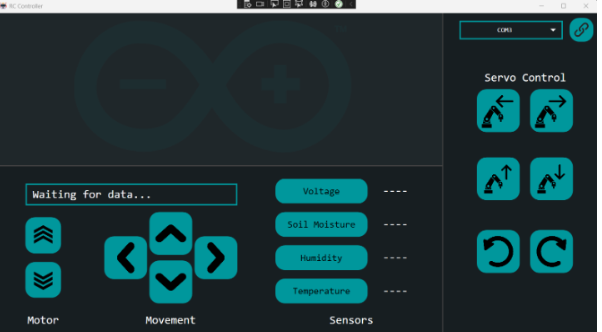
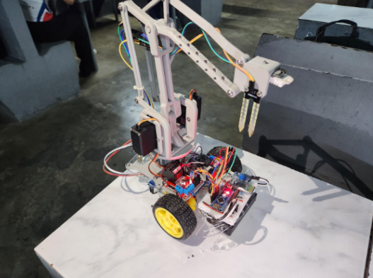

# Garden Assistant Bot (GAB)

[](https://github.com/gabrielhipolito-dev/Garden_Assistant_Bot/actions/workflows/ci.yml)
[](LICENSE)

Garden Assistant Bot (GAB) is a Bluetooth-controlled rover with a multi-axis servo arm and environmental sensors. A WPF desktop app drives the robot and displays live readings for soil moisture, temperature, humidity, and battery voltage.

## Demo


## Screenshot gallery

| WPF control UI | Robot hardware layout |
| --- | --- |
|  |  |

## System overview

- **Desktop app (WPF)**: operator controls, live telemetry, and status logging.
- **Firmware (Arduino Nano)**: motor control, servo actuation, and sensor sampling.
- **Bluetooth link (HC-05)**: serial command channel at 9600 baud.
- **Hardware stack**: 2WD drive base, 4-DOF arm, DHT22, soil moisture sensor, voltage monitoring.

## Repository structure

```
./src/desktop-app        # WPF controller app
./firmware/arduino       # Arduino Nano firmware
./docs                   # Architecture, setup, protocol
./hardware               # BOM, wiring, CAD (future)
./media                  # Screenshots, UI assets, demo
```

## Hardware BOM (summary)

- Arduino Nano (CH340)
- HC-05 Bluetooth module
- L298N motor driver
- 3x MG996R servo motors
- DHT22 temperature/humidity sensor
- HW-080 soil moisture sensor
- Voltage sensor module
- 2x 18650 batteries + holder
- Toggle switch, wiring, chassis

Full details: [docs/hardware.md](docs/hardware.md)

## Software prerequisites

- Visual Studio 2022 (Windows)
- .NET 8 SDK
- Arduino IDE

## Build and run

### Firmware (Arduino Nano)

1. Open `firmware/arduino/lupa_tusok_updated_ver.ino` in Arduino IDE.
2. Select **Board → Arduino Nano** and **Processor → ATmega328P (Old Bootloader)**.
3. Select the correct COM port and click **Upload**.

### Desktop app (WPF)

1. Open `rc_controller.sln` in Visual Studio 2022.
2. Build and run the `rc_controller` project.
3. Choose the Bluetooth COM port and click **Connect**.

## How it works

- The desktop app sends single-character commands over Bluetooth (9600 baud).
- The Arduino firmware interprets commands to drive motors, move servos, or return sensor data.
- Sensor responses are returned as newline-delimited strings and displayed in the UI.

Protocol details: [docs/communication-protocol.md](docs/communication-protocol.md)

## CI workflow

GitHub Actions builds the WPF app on Windows for every push and pull request using `dotnet build`.

## Project status / roadmap

- ✅ WPF control app with live telemetry
- ✅ Arduino firmware for drive, arm, and sensors
- 🔜 Add calibration tooling for sensors
- 🔜 Add structured telemetry logging (CSV export)
- 🔜 Publish enclosure CAD and wiring diagrams

## Documentation

- [Architecture](docs/architecture.md)
- [Setup guide](docs/setup.md)
- [Firmware notes](docs/firmware.md)
- [Hardware BOM](docs/hardware.md)
- [Communication protocol](docs/communication-protocol.md)

## Contributing

See [CONTRIBUTING.md](CONTRIBUTING.md).

## License

This project is licensed under the MIT License. See [LICENSE](LICENSE).
